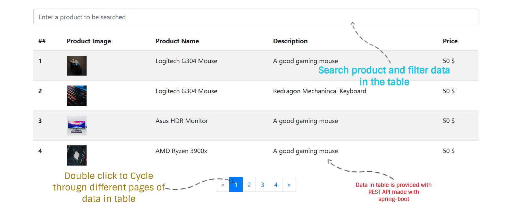

# Product Search

A Progressive Web App which displays the Product list retrieved from REST API.

# Project Setup

### Frontend

- Navigate to the Frontend folder.
- Run `ng serve` or `npm run start` for a UI server.
- Navigate to `http://localhost:4200/`.
- The app will automatically reload if you change any of the source files.

### Backend

- Navigate to the backend folder.
- Run `server.bat` file in Windows.
- `mvn install && mvn spring-boot:run` in Linux or Unix System.

`Note: Run Backend server before the Frontend server to see the actual product.`

# Features
- Search products in the search bar and get results as you start typing.
- Navigate all the products with the use of navigation buttons under the table.
- Products are sorted by Name in every page.

# Dependencies

## Spring-Boot

- Spring Boot starter Web
- Spring Boot starter Test
- json-simple 1.1.1

## Angular

- Bootstrap 4
- Ng-bootstrap

# Built With

- **[Angular](https://angular.io/)** - One framework. Mobile & desktop.
- **[SpringBoot](https://spring.io/projects/spring-boot)** - Spring Boot makes it easy to create stand-alone, production-grade Spring based Applications that you can "just run".

## Contributing

Currently not accepting any contributions.

## Authors

- **Pulkit Banta** - _Initial work_ - [PulkitBanta](https://github.com/PulkitBanta/)
